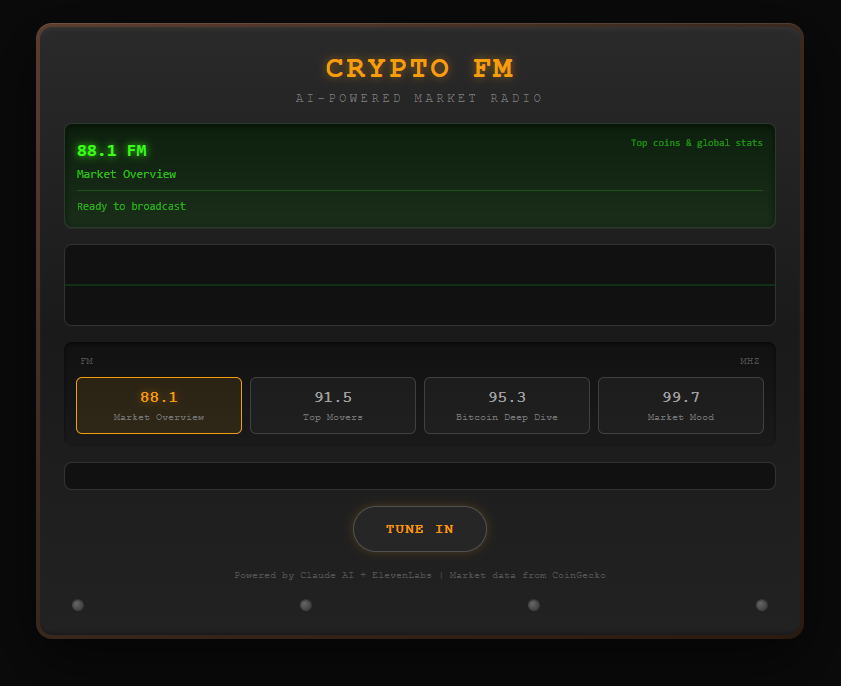

# CryptoFM - AI-Powered Crypto Radio Station

An AI radio station that delivers live cryptocurrency market updates through synthesized voice audio. Tune in to hear DJ CryptoWave break down the latest market action with real-time data, AI-generated commentary, and text-to-speech audio.

**Built for the AI Builder Competition - Week 4: "Soundwave"**

**[Live App](https://crypto-radio-lyart.vercel.app/)**



## How It Works

1. **Select a station** - Choose from 4 radio segments (88.1 - 99.7 FM)
2. **Hit TUNE IN** - The app fetches live market data from CoinGecko
3. **AI writes the script** - Claude generates a DJ-style commentary based on real data
4. **Voice synthesis** - ElevenLabs converts the script to realistic speech audio
5. **Listen & watch** - Audio plays with a retro VU meter visualizer

## Radio Segments

| Frequency | Segment | What You'll Hear |
|-----------|---------|-----------------|
| 88.1 FM | Market Overview | Top coins & global market stats |
| 91.5 FM | Top Movers | Biggest 24h gainers & losers |
| 95.3 FM | Bitcoin Deep Dive | Detailed BTC analysis |
| 99.7 FM | Market Mood | Sentiment & vibes check |

## Tech Stack

- **Frontend:** React + Vite + Tailwind CSS v4
- **Backend:** Vercel Serverless Functions
- **AI Script:** Claude API (Anthropic)
- **Voice:** ElevenLabs Text-to-Speech
- **Data:** CoinGecko API (free tier)

## Local Development

```bash
# Install dependencies
npm install

# Set environment variables
cp .env.example .env.local
# Add your API keys to .env.local

# Run dev server
npm run dev
```

### Environment Variables

| Variable | Description |
|----------|-------------|
| `ANTHROPIC_API_KEY` | Claude API key for script generation |
| `ELEVENLABS_API_KEY` | ElevenLabs API key for text-to-speech |

## Deploy to Vercel

1. Push to GitHub
2. Import project in Vercel
3. Add environment variables (`ANTHROPIC_API_KEY`, `ELEVENLABS_API_KEY`)
4. Deploy

## Architecture

```
User clicks TUNE IN
  → Fetch market data (CoinGecko via serverless proxy)
  → Generate DJ script (Claude API)
  → Synthesize speech (ElevenLabs API)
  → Play audio with canvas visualizer (Web Audio API)
```

All API keys are kept server-side in Vercel serverless functions. The frontend only receives audio blobs and JSON data.

## License

MIT
